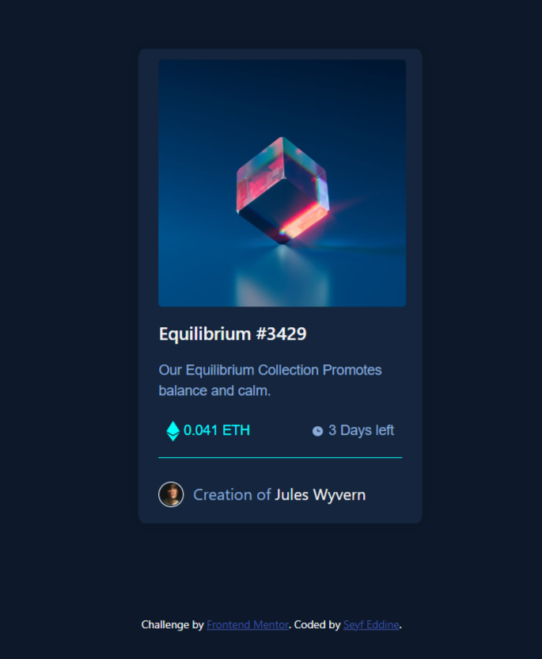

# Frontend Mentor - NFT preview card component solution

This is a solution to the [NFT preview card component challenge on Frontend Mentor](https://www.frontendmentor.io/challenges/nft-preview-card-component-SbdUL_w0U). Frontend Mentor challenges help you improve your coding skills by building realistic projects. 

## Table of contents

- [Overview](#overview)
  - [The challenge](#the-challenge)
  - [Screenshot](#screenshot)

- [My process](#my-process)
  - [Built with](#built-with)
  - [What I learned](#what-i-learned)
  - [Continued development](#continued-development)
  - [Useful resources](#useful-resources)

- [Author](#author)

- [Acknowledgments](#acknowledgments)

## Overview

### The challenge

Users should be able to:

- View the optimal layout depending on their device's screen size
- See hover states for interactive elements

### Screenshot

## My process

### Built with

- Basic HTML5 
- Basic CSS3
- Flexbox
- CSS Grid
- [Bootstrap](https://getbootstrap.com/) - CSS Framework

### What I learned

This challenge realy helps me understand how things work , i used to learn a lot but cant build real stuff , nom im able ot at least 
i have the courage in any project , i understood a lot of stuff like : bootstrap , flexbox , css grid system , and many other details i cant 
list them all in this small desciption.

### Continued development

in this project , there was'nt any Js , or complicated stuff , it was a ready card in bootstrap all i did was some change
but if gets any complacted i would suffer , so i would rather working with more developed stuff like React , and thats what
i will focus on next months.

### Useful resources

- [Resource 1](https://www.w3schools.com/) - This helps a lot to understand how things work in HTML and CSS
- [Resource 2](https://stackoverflow.com/) - This was my little friend , i founded soulutions for my all the problems i faced

## Author

- Frontend Mentor - [@seyfeddine13](https://www.frontendmentor.io/profile/seyfeddine13)

## Acknowledgments

I would like to give some credits to my mates yasser and sami that answered my question , and guide me through my journey.

